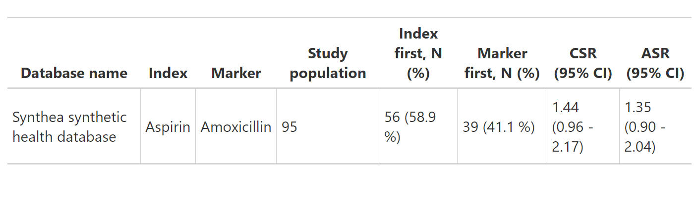

 
<!-- README.md is generated from README.Rmd. Please edit that file -->
 
```{r, include = FALSE}
knitr::opts_chunk$set(
  collapse = TRUE,
  comment = "#>",
  fig.path = "man/figures/README-",
  out.width = "100%"
)
```
 
# CohortSymmetry 
 
<!-- badges: start -->
<!-- badges: end -->
 
The goal of CohortSymmetry is to carry out the necessary calculations for Sequence Symmetry Analysis (SSA). It is highly recommended that this method is tested beforehand against well-known positive and negative controls. Such controls could be found using the paper in the Reference. <sup>1</sup>
 
## Installation
 
You can install the development version of CohortSymmetry from [GitHub](https://github.com/) with:
 
``` r
# install.packages("devtools")
devtools::install_github("oxford-pharmacoepi/CohortSymmetry")
```
 
## Example
### Create a reference to data in the OMOP CDM format 
The CohortSymmetry package is designed to work with data in the OMOP CDM (Common Data Model) format, so our first step is to create a reference to the data using the `CDMConnector` package.
 
As an example, we will be using Eunomia data set.
```{r, message=FALSE, eval=TRUE, warning=FALSE}
library(CDMConnector)
library(dplyr)
library(DBI)
library(duckdb)
 
db <- DBI::dbConnect(duckdb::duckdb(), 
                     dbdir = CDMConnector::eunomia_dir())
cdm <- cdm_from_con(
  con = db,
  cdm_schema = "main",
  write_schema = "main"
)
```
 
### Step 0: Instantiate two cohorts in the cdm reference
This will be entirely user's choice on how to generate such cohorts. Minimally, this package requires two cohort tables in the cdm reference, namely the index_cohort and the marker_cohort.
 
If one wants to generate two drugs cohorts in cdm, DrugUtilisation is recommended. For merely illustration purposes, we will carry out PSSA on aspirin (index_cohort) against amoxicillin (marker_cohort)
 
```{r Example - Step 0: Using DrugUtilisation, eval=TRUE, warning=FALSE}
library(dplyr)
library(DrugUtilisation)
cdm <- DrugUtilisation::generateIngredientCohortSet(
  cdm = cdm, 
  name = "aspirin",
  ingredient = "aspirin")

cdm <- DrugUtilisation::generateIngredientCohortSet(
  cdm = cdm,
  name = "amoxicillin",
  ingredient = "amoxicillin")
```
 
### Step 1: generateSequenceCohortSet
 
In order to initiate the calculations, the two cohorts tables need to be intersected using `generateSequenceCohortSet()`. This process will output all the individuals who appeared on both tables according to a user-specified parameters. This includes `timeGap`, `washoutWindow`, `indexMarkerGap` and `daysPriorObservation`. Details on these parameters could be found on the vignette.
 
```{r Step 1: generateSequenceCohortSet, eval=TRUE, warning=FALSE}
library(CohortSymmetry)
 
cdm <- generateSequenceCohortSet(
  cdm = cdm,
  indexTable = "aspirin",
  markerTable = "amoxicillin",
  name = "aspirin_amoxicillin"
)

cdm$aspirin_amoxicillin %>% 
  dplyr::glimpse()
```

### Step 2: summariseSequenceRatio
 
To get the sequence ratios, we would need the output of the generateSequenceCohortSet() function to be fed into `summariseSequenceRatio()` 
The output of this process contains cSR(crude sequence ratio), aSR(adjusted sequence ratio) and confidence intervals.

```{r Step 2: summariseSequenceRatio, eval=TRUE, warning=FALSE}
res <- summariseSequenceRatio(cohort = cdm$aspirin_amoxicillin)
 
res %>% glimpse()
```

### Step 3: visualise the results
 
The user could then visualise their results using a wide array of provided tools.

For example, the following produces a gt table.

```{r Step 3: visualise the results - tables, eval=FALSE, warning=FALSE}
gt_results <- tableSequenceRatios(result = res)

gt_results
```


Note that flextable is also an option, users may specify this by using the `type` argument.

One could also visualise the plot, for example, the following is the plot of the adjusted sequence ratio.

```{r Step 3: visualise the results - plots, eval=FALSE, warning=FALSE}
plotSequenceRatios(result = res,
                  onlyaSR = T,
                  colours = "black")
```


The user also has the freedom to plot temporal trend like so:

```{r Step 3: visualise the results - plot temporal, eval=FALSE, warning=FALSE}
plotTemporalSymmetry(cdm = cdm, sequenceTable = "aspirin_amoxicillin")
```


### Disconnect from the cdm database connection
```{r Disconnect from the cdm database connection, eval=TRUE, warning=FALSE}
CDMConnector::cdmDisconnect(cdm = cdm)
```

## References
1. Pratt N, Chan EW, Choi NK, et al. Prescription sequence symmetry analysis: assessing risk, temporality, and consistency for adverse drug reactions across datasets in five countries. Pharmacoepidemiol Drug Saf. 2015;24(8):858-864.
