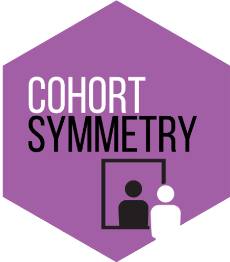

<!-- README.md is generated from README.Rmd. Please edit that file -->

# CohortSymmetry 

<!-- badges: start -->
<!-- badges: end -->

The goal of CohortSymmetry is to carry out the necessary calculations
for Sequence Symmetry Analysis (SSA).

## Installation

You can install the development version of CohortSymmetry from
[GitHub](https://github.com/) with:

``` r
# install.packages("devtools")
devtools::install_github("oxford-pharmacoepi/CohortSymmetry")
```

## Example

This is a basic example which carries out the necessary calculations for
Sequence Symmetry Analysis:

### Create a reference to data in the OMOP CDM format

The CohortSymmetry package is designed to work with data in the OMOP CDM
(Common Data Model) format, so our first step is to create a reference
to the data using the CDMConnector package.

As an example, we will be utilising the Eunomia data set.

``` r
library(CDMConnector)
library(dplyr)
library(DBI)
library(duckdb)
 
db <- DBI::dbConnect(duckdb::duckdb(), 
                     dbdir = CDMConnector::eunomia_dir())
cdm <- cdm_from_con(
  con = db,
  cdm_schema = "main",
  write_schema = "main"
)
```

### Step 0: Instantiate two cohorts in the cdm reference

This will be entirely user’s choice on how to generate such cohorts.
Minimally, this package requires two tables in the cdm reference to be
cohort tables; in other words, the columns of these tables should
contain cohort_definition_id, subject_id, cohort_start_date and
cohort_end_date.

If one wants to generate two drugs cohorts in cdm, DrugUtilisation is
recommended. As an example, amiodarone and levothyroxine are used.
Famously, this is a known positive control in [Pratt et
al.](https://www.ncbi.nlm.nih.gov/pmc/articles/PMC4690514/)

``` r
library(DrugUtilisation)
library(CodelistGenerator)
library(dplyr)
 
index_drug <- CodelistGenerator::getDrugIngredientCodes(cdm = cdm, name = "amiodarone")
marker_drug <- CodelistGenerator::getDrugIngredientCodes(cdm = cdm, name = "levothyroxine")
 
cdm <- DrugUtilisation::generateDrugUtilisationCohortSet(
    cdm = cdm,
    name = "cohort1",
    conceptSet = index_drug
  )
 
cdm <- DrugUtilisation::generateDrugUtilisationCohortSet(
    cdm = cdm,
    name = "cohort2",
    conceptSet = marker_drug
  )
 
cdm$cohort1 %>%
  dplyr::glimpse()
 
cdm$cohort2 %>%
  dplyr::glimpse()
```

### Step 1: getCohortSequence

In order to initiate the calculations, the two cohorts tables need to be
combined together. The first cohort is considered to be the index cohort
while the second is the marker.

This process will filter out the individuals who appeared on both tables
according to a user-specified timeGap (default 365, it can also be
changed to Inf if no such restriction is preferred).

The user also has the freedom to specify more than 1 IDs from either
table that can be considered for this process. More concretely, if an
user specifies m IDs from the first cohort and n IDs from the second
cohort, this process will output mn combinations. If IDs are not
specified then all IDs will be considered.

``` r
library(CohortSymmetry)
 
cdm <- CohortSymmetry::getCohortSequence(cdm,
                   indexTable ="cohort1",
                   markerTable = "cohort2",
                   timeGap = Inf)
 
cdm$joined_cohorts %>%
  dplyr::glimpse()
 
```
